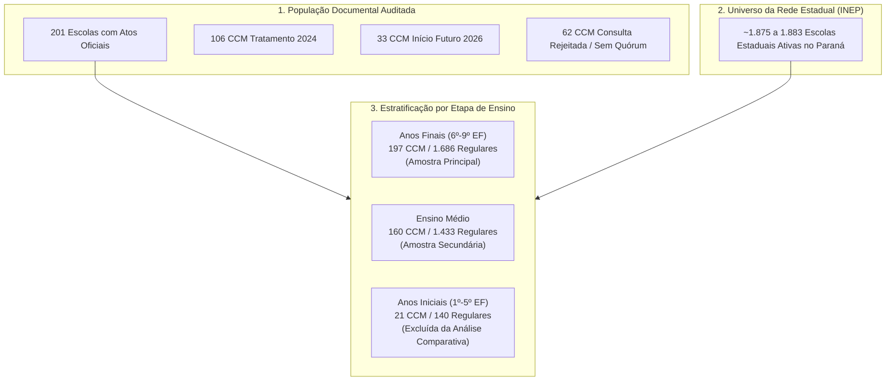

# Elegibilidade de Dados e População Analítica

> **Investigação**: Colégios Cívico-Militares do Paraná  
> **Documento**: Mapeamento de Populações Analíticas, Elegibilidade e Atrição  
> **Data**: 2026-09-18  
> **Status**: Auditado e Validado  

---

## 1. Visão Geral da População Escolar

O desenho amostral e analítico exige a delimitação rigorosa entre a base factual documentada, o universo da rede estadual de ensino e as subamostras que possuem dados válidos para cada indicador e etapa educacional.

Nenhuma exclusão é realizada de forma implícita ou não documentada. Todas as perdas amostrais e motivos de não inclusão estão explicitados neste documento.



---

## 2. Estrutura das Amostras por Etapa de Ensino

A oferta educacional no Paraná varia conforme a tipologia da unidade escolar. Uma mesma escola pode ofertar múltiplos níveis de ensino simultaneamente. A análise é estritamente estratificada por etapa para respeitar a métrica pedagógica e os currículos específicos.

### 2.1. Anos Finais do Ensino Fundamental (6º ao 9º Ano) — Amostra Principal
- **Relevância**: É a etapa central da política pública dos Colégios Cívico-Militares no Paraná. Concentra a maior cobertura de dados censitários e a série histórica mais longa e estável do SAEB e do IDEB (2005 a 2023).
- **Cobertura CCM**: Das 201 escolas auditadas, **197 escolas** ofertam Anos Finais.
- **Distribuição no Lote de Tratamento 2024**: **106 escolas** (100% do lote de implantação de 2024).
- **Universo de Controle Regular Estadual**: **1.686 escolas** com histórico SAEB/IDEB e **1.875 escolas** no Censo Escolar (Rendimento).

### 2.2. Ensino Médio — Amostra Secundária
- **Relevância**: Etapa subsequente, também contemplada pelo modelo militar.
- **Limitação Histórica**: O SAEB tornou-se censitário para o Ensino Médio somente a partir da edição de **2017**. Antes disso (2005 a 2015), a avaliação no Ensino Médio era amostral, o que impede a construção de séries históricas longas por escola pré-2017.
- **Cobertura CCM**: **160 escolas** do universo auditado ofertam Ensino Médio (sendo 81 do lote 2024).
- **Tratamento Analítico**: Avaliada em modelo independente e estratificado, com baseline restrito a 2017–2023.

### 2.3. Anos Iniciais do Ensino Fundamental (1º ao 5º Ano) — Amostra Excluída da Análise Principal
- **Diagnóstico Factual**: Na rede pública do Paraná, os Anos Iniciais são de competência predominantemente **municipal** (processo de municipalização do ensino fundamental). Apenas 21 escolas da lista CCM possuem registros residuais de turmas de Anos Iniciais nos cadastros do INEP, e o número de escolas estaduais com SAEB divulgado para Anos Iniciais é irrisório (menos de 140 em todo o estado).
- **Decisão Metodológica**: **Exclusão completa** dos Anos Iniciais da análise comparativa principal de impacto e linha de base, evitando distorções decorrentes de amostras residuais e não representativas da rede estadual.

---

## 3. Matriz de Elegibilidade Analítica

A tabela abaixo sintetiza a população original, a população elegível por indicador e as perdas de observação decorrentes de critérios técnicos do INEP ou de ausência de oferta:

| Análise / Etapa | Grupo Temporal | N Escolas Cadastradas | N Escolas Ofertantes da Etapa | SAEB 2023 com Nota Válida | Rendimento 2023 com Taxa Válida | IDEB 2023 com Índice Calculado | Motivo Principal de Perdas / Não Inclusão |
| :--- | :--- | :---: | :---: | :---: | :---: | :---: | :--- |
| **Anos Finais (Principal)** | **Tratamento 2024** | 106 | 106 | 103 (97,2%) | 105 (99,1%) | 103 (97,2%) | 2 escolas com dado ausente no SAEB 2023; 1 escola recém-criada sem histórico pré-2023 (`41164920`) |
| **Anos Finais (Principal)** | **Futuro 2026** | 33 | 32 | 27 (84,4%) | 29 (90,6%) | 27 (84,4%) | 1 escola sem oferta da etapa; 4 escolas sem participação/divulgação no SAEB |
| **Anos Finais (Principal)** | **Consulta Rejeitada** | 62 | 62 | 59 (95,2%) | 61 (98,4%) | 59 (95,2%) | 2 escolas com não-divulgação/ausência no SAEB; 1 sem registro de rendimento |
| **Anos Finais (Principal)** | **Controle Regular Geral** | 1.883 | 1.875 | 1.472 (78,5%) | 1.705 (90,9%) | 1.472 (78,5%) | 196 escolas sem participação no SAEB; 12 com dado ausente; critérios censitários de fluxo |
| **Ensino Médio (Secundária)** | **Tratamento 2024** | 106 | 81 | 75 (92,6%) | 81 (100,0%) | 75 (92,6%) | 25 escolas CCM não ofertam Ensino Médio; 6 escolas sem participação no SAEB 2023 |
| **Ensino Médio (Secundária)** | **Futuro 2026** | 33 | 25 | 24 (96,0%) | 25 (100,0%) | 24 (96,0%) | 8 escolas não ofertam Ensino Médio; 1 escola sem participação no SAEB 2023 |
| **Ensino Médio (Secundária)** | **Consulta Rejeitada** | 62 | 54 | 50 (92,6%) | 54 (100,0%) | 50 (92,6%) | 8 escolas não ofertam Ensino Médio; 4 escolas sem participação no SAEB 2023 |
| **Ensino Médio (Secundária)** | **Controle Regular Geral** | 1.593 | 1.433 | 1.207 (84,2%) | 1.433 (100,0%) | 1.207 (84,2%) | 182 escolas sem participação no SAEB; 14 com dados ausentes |
| **Anos Iniciais (Residual)** | **Todas as Categorias** | 201 | 21 | 13 (61,9%) | 21 (100,0%) | 13 (61,9%) | **Excluída da análise comparativa** (etapa de competência municipal; oferta estadual atípica) |

---

## 4. Análise de Atrição e Viés de Seleção por Não-Divulgação (`ND`)

### 4.1. Regras Oficiais de Divulgação do INEP
O INEP aplica regras estritas de sigilo e representatividade para divulgar resultados escolares no SAEB:
1. Pelo menos **10 estudantes presentes** no momento da aplicação da prova na etapa avaliada;
2. Taxa de participação de pelo menos **80% dos estudantes matriculados** na série avaliada (conforme apurado no Censo Escolar daquele ano).

As escolas que não atingem esses parâmetros são classificadas como:
- `NAO_DIVULGADO_CRITERIO_INEP` (abreviado historicamente como `ND`);
- `SEM_PARTICIPACAO` (escolas que não aderiram à aplicação censitária ou cujas turmas não foram avaliadas).

### 4.2. Diagnóstico Empírico de Atrição no SAEB 2023
A análise da distribuição do status de participação revela um padrão claro:

```text
Status SAEB 2023 — Anos Finais (Rede Estadual do Paraná):
-------------------------------------------------------------------------
Status                            Tratamento 2024    Controle Regular
-------------------------------------------------------------------------
DIVULGADO                             98,1% (103)         87,3% (1.472)
SEM_PARTICIPACAO                       0,0%   (0)         11,6%   (196)
DADO_AUSENTE / NÃO DIVULGADO           1,9%   (2)          1,1%    (18)
-------------------------------------------------------------------------
Total de Escolas na Etapa            100,0% (105)        100,0% (1.686)
```

### 4.3. Implicações Críticas para o Desenho
1. **As escolas selecionadas para o modelo CCM não são uma amostra aleatória da rede**: Elas possuem uma taxa de participação/divulgação no SAEB significativamente superior à das escolas de controle regular (98,1% vs. 87,3%). Nenhuma escola do lote CCM 2024 ficou no status `SEM_PARTICIPACAO` em 2023.
2. **Viés de Pequenas Escolas no Controle Regular**: As escolas com resultado não divulgado ou sem participação no grupo de controle regular são predominantemente escolas pequenas (menos de 10 alunos por série) ou com elevados índices de absenteísmo discente.
3. **Necessidade Imperativa de Pareamento**: Comparar diretamente a média bruta de todas as escolas regulares com as escolas CCM geraria um viés de seleção favorável às CCMs decorrente unicamente do tamanho e engajamento discente na prova. O pareamento (*Propensity Score Matching*) corrige esse desbalanceamento ao parear apenas escolas regulares com histórico prévio completo e similar porte discente.

---

## 5. Casos Especiais e Critérios de Exclusão Individual

| Código INEP | Nome da Escola | Município | Situação Factual | Tratamento no Desenho Analítico |
| :---: | :--- | :--- | :--- | :--- |
| **`41146093`** | CE PROF PEDRO MACIEL | Curitiba | Erro material no Edital 125/2025. O edital de retificação nº 136/2025 corrigiu o código da escola para `41016254` | **Excluído das análises estatísticas**. Permanece registrado exclusivamente no log de auditoria documental para rastreabilidade histórica. |
| **`41164920`** | IRONDI MANTOVANI PUGLIESI C E | Arapongas | Escola criada recentemente, com início de atividades registrado nos cadastros após 2020 | **Excluída das análises de tendência prévia longa (2005–2019)** por ausência estrutural de linha de base. Elegível apenas em análises transversais de 2023 em diante. |
| **`41167090`** | CE CIV MIL DIOGO RAMOS | Curitiba | Unidade escolar recém-criada no sistema estadual | **Excluída de modelos longitudinais pré-intervenção** por ausência de observações no período prévio. |

---

## 6. Tratamento de Valores Ausentes no Pipeline

Em conformidade com as diretrizes do pré-registro:
1. **Ausência não é Zero**: Registros sem dados mantêm o valor `NaN` nas colunas numéricas de proficiência e taxas. Nenhuma taxa de abandono ausente é assumida como 0%, e nenhuma proficiência ausente é preenchida com a média.
2. **Rastreabilidade Categórica**: Todas as tabelas consolidadas preservam as colunas descritivas de status:
   - `status_participacao_saeb`: `DIVULGADO`, `NAO_DIVULGADO_CRITERIO_INEP`, `SEM_PARTICIPACAO`, `DADO_AUSENTE`.
   - `status_rendimento`: `DIVULGADO`, `SEM_INFORMACAO`, `DADO_AUSENTE`.
   - `status_ideb`: `DIVULGADO`, `SEM_INFORMACAO`, `DADO_AUSENTE`.
3. **Casos Completos para Modelagem Causal**: Na estimação do Escore de Propensão (PSM), exige-se que a unidade possua os dados prévios observados para todas as covariáveis do modelo (amostra de casos completos balanceada: 90 escolas tratadas e 1.351 escolas de controle na especificação com linha de base 2019).
